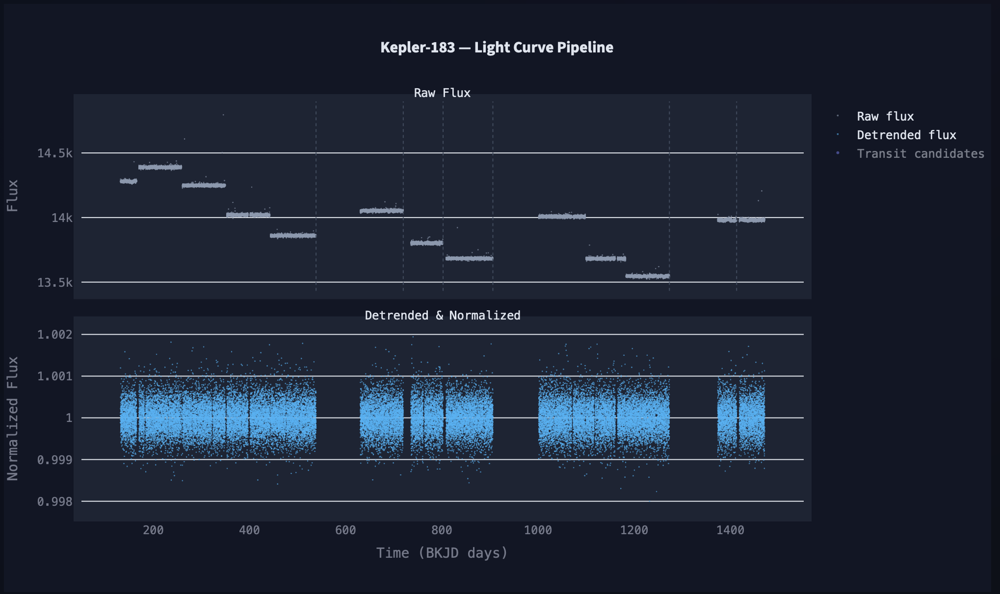
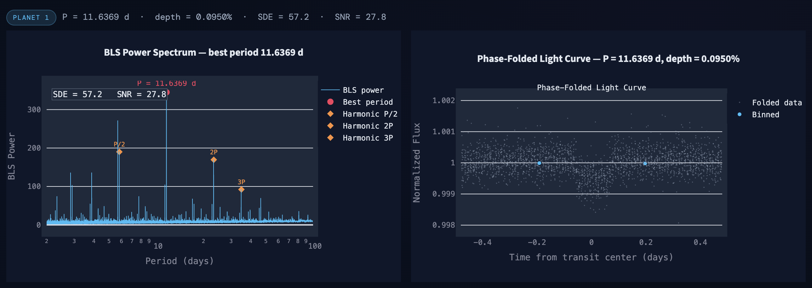
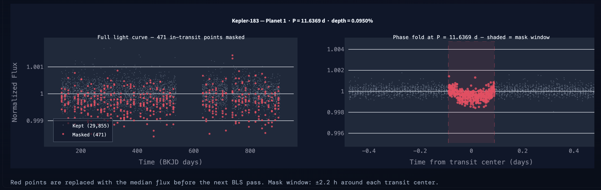
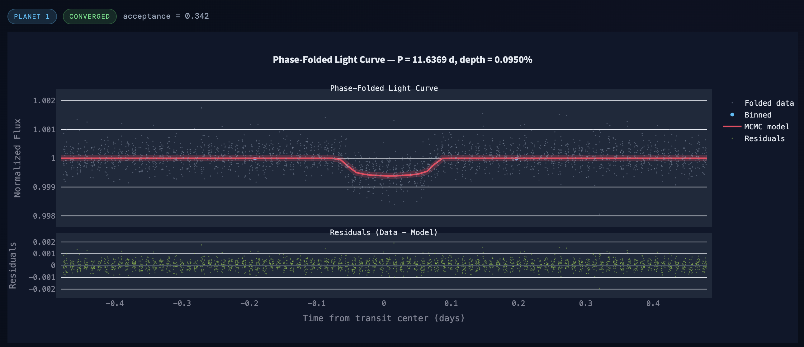
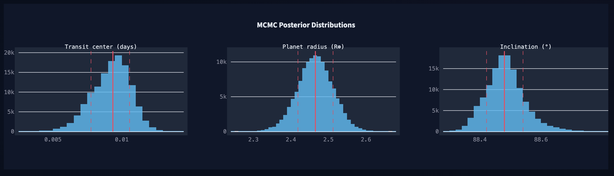
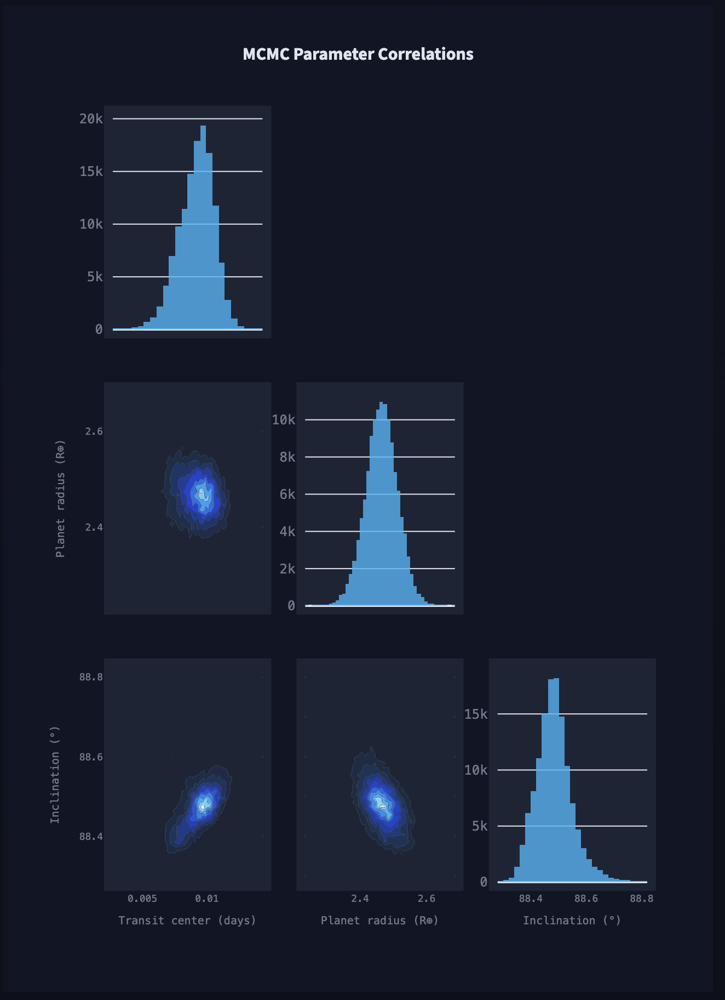
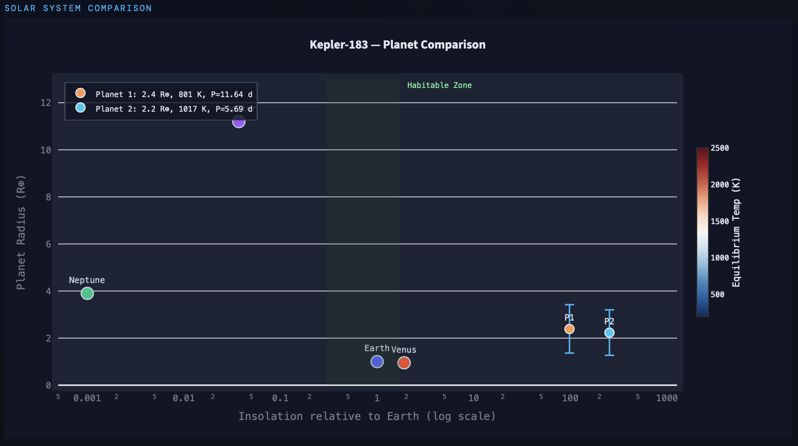

# exotransit

A transit detection pipeline built from scratch to find exoplanets from real Kepler photometry. Demonstrates signal processing on time-series data, Box Least Squares (BLS) period search, Bayesian parameter estimation with Markov Chain Monte Carlo (MCMC), uncertainty propagation via posterior sampling, machine learning-based false positive vetting, and an interactive Streamlit app. Debugged and validated against NASA ephemerides.

**Live app: [exotransit.streamlit.app](https://exotransit.streamlit.app/)**

---

## Demo — Kepler-183

| Raw & detrended light curve | BLS power spectrum & phase fold |
|---|---|
|  |  |

| Transit masking | Phase fold with MCMC fit |
|---|---|
|  |  |

| MCMC posterior distributions | MCMC parameter correlations |
|---|---|
|  |  |



---

## What it does

Given a Kepler star name, the pipeline:

1. Downloads the light curve from NASA MAST and detrends stellar variability with a two-pass biweight filter
2. Runs Box Least Squares period search across up to 25,000 candidate periods
3. Vets each detection with a decision tree classifier trained on 1,250 labeled BLS candidates
4. Iterates, masking found planets and re-running BLS, to detect multiple planets
5. Fits a physical transit model to each detection using MCMC (emcee + batman)
6. Derives planet radius, semi-major axis, equilibrium temperature, and insolation with full uncertainty propagation from MCMC posteriors

---

## Pipeline

### 1. Light curve ingestion

Raw photometry downloaded from NASA MAST via [lightkurve](https://lightkurve.github.io/lightkurve/). Multiple quarters (~90 days each) are stitched together, each normalized independently to remove inter-quarter flux jumps from spacecraft rotations.

Per-quarter: remove NaNs → sigma-clip upward outliers only (5σ upper threshold, lower threshold disabled so transit dips are never removed) → normalize to unit flux.

Detrending runs in two passes. **Pass 1** uses a biweight filter across the full baseline; the biweight down-weights outliers including transit dips, producing a clean enough light curve for BLS. **Pass 2** runs after BLS has identified all planet periods: transit windows are explicitly set to NaN before the filter runs, so the trend estimate at each transit comes entirely from out-of-transit stellar continuum. This recovers the full transit depth for MCMC fitting. Without Pass 2, even the biweight's down-weighting partially fills in transit dips, causing systematically underestimated planet radii.

### 2. BLS period search

Box Least Squares (Kovács, Zucker & Mazeh 2002) tests thousands of period/duration combinations, phase-folding the light curve at each and scoring the fit of a box-shaped dip. Two quality metrics: **SDE** (Signal Detection Efficiency, how many standard deviations the peak rises above the noise floor) and **SNR** (depth divided by uncertainty).

Period grid: uniform in frequency with step df = min_duration / baseline², capped at 25,000 points. Duration grid: 15 geometrically-spaced values from ~30 min to a max bounded by the minimum search period.

### 3. Reliability vetting

A decision tree classifier trained on 1,250 labeled BLS candidates from 250 Kepler targets. Features: SDE, SNR, transit duration, duty cycle, in-transit data points, expected transit windows, per-transit SNR, and transit point coverage ratio.

**Training performance: 96.1% precision, 95.0% recall, F1 = 0.955** — eliminating 628 of 651 false positives while retaining 569 of 599 real planets.

The dominant feature is SDE (86% of information gain). Real planet detections have median SDE ~47. False positives from Kepler instrument systematics cluster at SDE ~7. The tree's root split at SDE = 15.12 is the empirical point where the two populations stop overlapping, more than twice the NASA Threshold Crossing Event (TCE) floor of 7.1, which was designed to maximize recall for a human-reviewed pipeline, not precision for an app showing results directly to users.

On the full 250-target validation run, 77% of targets are fully clean (193 of 250 pass with no false positives and no missed planets). The remaining 23% have either a spurious detection or a missed planet. This is the expected behavior for a pipeline optimized for precision: when in doubt, it does not report.

See [VETTING.md](VETTING.md) for the full story: why NASA's TCE framework was implemented first, why it didn't work, and what the empirical approach found. See [VALIDATION.md](VALIDATION.md) for planet-level radius recovery results across five Kepler systems (15 planets total, down to 0.84 R⊕).

### 4. Multi-planet detection

After finding each planet, its transit windows are median-filled and BLS runs again on the residuals. If a candidate period matches one already found (within 5%), it is skipped but the search continues. The search terminates when the decision tree rejects a new candidate.

### 5. Transit model fitting — MCMC

[emcee](https://emcee.readthedocs.io/) ensemble sampler with [batman](https://lkreidberg.github.io/batman/) transit models. Free parameters: transit center time `t0`, radius ratio `rp` (Rp/R★), and impact parameter `b`. Limb darkening fixed to quadratic coefficients from Claret (2011) Kepler tables interpolated from the star's Teff, log g, and metallicity. Semi-major axis derived from Kepler's 3rd law rather than fit freely, coupling transit duration to orbital physics.

Exposure time smearing correction: Kepler's 30-min cadence averages brightness over the full window. The model supersamples each exposure into sub-cadence points, averages, then compares to data, matching what the detector physically measures and preventing radius underestimation from smeared ingress/egress profiles.

### 6. Physical parameter derivation

MCMC posteriors combined with NASA Exoplanet Archive stellar parameters to derive planet radius, semi-major axis, equilibrium temperature, and insolation. Uncertainty propagation by sampling: stellar parameters drawn from Gaussians, combined with MCMC samples point-by-point, percentiles of the resulting distributions give medians and 1σ bounds.

---

## Architecture

```
app.py                       — Streamlit entry point
config.py                    — configuration profiles (MEDIUM / FULL)

exotransit/
  pipeline/
    light_curves.py      — download, stitch, biweight-detrend; Pass 2 redetrend
    observations.py      — available quarter/sector listing for the UI
    helpers.py           — flux_err extraction

  detection/
    bls.py               — BLS period search, BLSResult dataclass
    result_evaluation.py — decision tree reliability vetting
    multi_planet.py      — iterative multi-planet search, transit masking,
                           Pass 2 redetrend; returns (planets, mask_data, refined_lc)

  mcmc/
    fit_mcmc.py          — emcee sampler, MCMCResult dataclass
    helpers.py           — batman transit model, log posterior

  physics/
    stars.py             — NASA Exoplanet Archive TAP/ADQL queries
    planets.py           — physical parameter derivation with uncertainty sampling
    limb_darkening.py    — Claret (2011) LD table interpolation

  viz/
    plots.py             — Plotly figures (light curve, BLS spectrum, phase fold,
                           MCMC spaghetti, corner plot, orrery, planet comparison)

  app/
    steps/               — Streamlit UI (step0–step4)

tests/
  validate_against_truth.py  — end-to-end validation against NASA ephemerides
  threshold_optimization/
    run_permissive_test.py     — permissive BLS data collection (no vetting gate)
    fit_thresholds_2stage.py   — grid search + decision tree fitting on labeled candidates
    bls_25000_8d/              — candidates and fit results from current config
```

---

## What I learned

**Sliding window detrending corrupts wide transits without masking.** Any local smoother blind to the transit signal partially fills it in. The fix is iterative: detect, mask, redetrend from pure stellar continuum.

**Tight MCMC posteriors are not evidence of a correct answer.** The sampler converges confidently even when the detrended data has been altered enough that the published transit geometry is no longer the maximum-likelihood solution. The diagnostic is to evaluate log-likelihood at known-truth parameters: if truth scores worse than the converged answer, the data was altered, not the model.

**SDE is almost all of the information.** Signal Detection Efficiency accounts for 86% of the decision tree's information gain. Real planet detections and false positives barely overlap in SDE space. The TCE threshold of 7.1 was calibrated for a recall-maximizing survey pipeline; empirically calibrated to this pipeline's output, the right split is 15.12.

**The right metric depends on the product, not the science.** NASA optimizes for recall: missing a real planet is the scientific failure mode, and false positives get vetted downstream. An app has no downstream vetting. The sin is different.

**Vetting thresholds are empirical parameters, not constants.** Running the pipeline in permissive mode on 250 targets, logging all BLS candidates, labeling them against NASA ephemerides, and scanning the threshold grid produced a better vetting classifier than any amount of hand-tuning TCE parameters.

---

## Running

```bash
streamlit run app.py
```

Configuration profiles (`MEDIUM` for Streamlit Cloud, `FULL` for local) are in `config.py`.

---

## Dependencies

```
lightkurve        — light curve download, stitching, preprocessing
emcee             — MCMC ensemble sampler
batman-package    — Mandel-Agol analytic transit light curve models
astropy           — time/unit handling, BLS implementation
numpy             — numerical core
pandas            — data handling
plotly            — interactive visualizations
streamlit         — web app
requests          — NASA Exoplanet Archive TAP queries
scikit-learn      — decision tree classifier for reliability vetting
```

---

## Known limitations

**Reliability threshold generalizability** — the decision tree was fit on Kepler long-cadence data from targets 1–250 and evaluated in-sample. It won't generalize to TESS, K2, short baselines, or active stars without retraining.

**Impact parameter degeneracy from detrending** — the biweight filter rounds ingress and egress shoulders, making the pipeline systematically recover the wrong impact parameter. Planet radii are unaffected (depth is preserved), but the inferred orbital geometry can differ substantially from published values. This is a fundamental limitation of detrending-based pipelines without explicit transit shape modeling.

**Transit timing variations** — BLS assumes perfectly periodic transits. Planets near mean-motion resonance have shifting transit times that reduce BLS SNR.

**Stellar activity** — the biweight filter removes slow trends but not flares or rotationally-modulated spot patterns.

**Eclipsing binary contamination** — the decision tree catches obvious cases via duty cycle and depth, but subtle contamination (secondary eclipses, background eclipsing binaries) requires centroid analysis or spectroscopic follow-up.

**Uncertainty underestimation** — the detrended light curve is treated as fixed truth. Detrending uncertainty does not propagate into MCMC posteriors.

---

## References

- [Kovács, Zucker & Mazeh (2002) — Box Least Squares algorithm](https://arxiv.org/abs/astro-ph/0206099)
- [Jenkins et al. (2010) — Kepler TCE pipeline and SDE threshold](https://arxiv.org/abs/1001.0258)
- [Mandel & Agol (2002) — Analytic transit light curve models (batman)](https://arxiv.org/abs/astro-ph/0210099)
- [Claret (2011) — Kepler quadratic limb darkening tables](https://www.aanda.org/articles/aa/full_html/2011/05/aa16451-11/aa16451-11.html)
- [Foreman-Mackey et al. (2013) — emcee ensemble MCMC sampler](https://arxiv.org/abs/1202.3665)